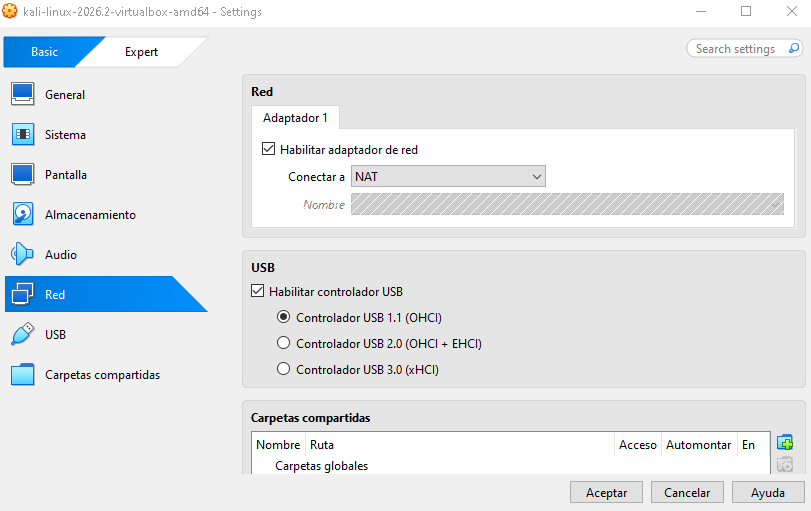
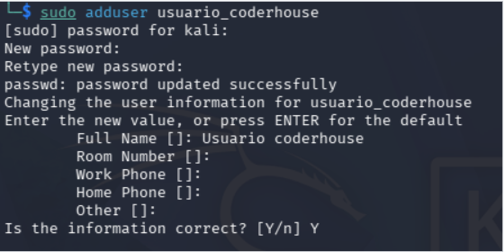
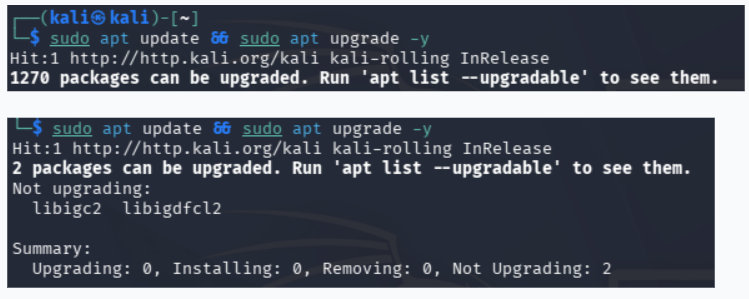
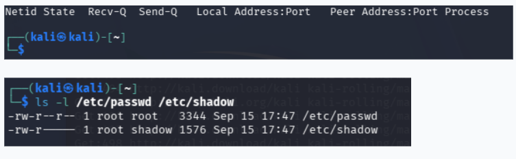
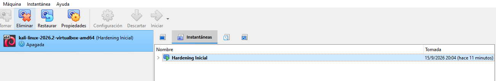

**REPORTE TÉCNICO DE CONFIGURACIÓN DE LABORATORIO Y HARDENING**

Pre-entrega N° 2 · Curso de Ciberseguridad Coderhouse

| Estudiante: | Guillermo Martinez |
| :---- | :---- |
| **Comisión / Tutor:** | 90870 |
| **Sistema Operativo del Lab:** | Kali Linux / Ubuntu / Windows |

**1\. Configuración de Red e Infraestructura Virtual**

Para el desarrollo del laboratorio seguro de ciberseguridad se utilizó el hipervisor Oracle VirtualBox, configurando un entorno virtualizado aislado (Guest) ejecutado sobre el sistema operativo anfitrión (Host). Esta separación física y lógica garantiza que las pruebas de auditoría y análisis no comprometan la máquina real.

**Aislamiento de Red mediante Modo NAT:**

Se seleccionó el modo de red NAT (Network Address Translation) para la interfaz de la máquina virtual. La ventaja técnica de este modo radica en que la VM puede iniciar conexiones salientes hacia internet para descargar repositorios y parches de seguridad, pero se encuentra detrás de un enrutamiento privado invisible desde el exterior, impidiendo que usuarios o atacantes externos inicien conexiones no solicitadas hacia la VM.

Por el contrario, se descartó el uso del modo Puente (Bridged), ya que este conecta la interfaz de la VM directamente al router doméstico asignándole una IP de la misma subred física. Esto expondría la máquina virtual a todos los dispositivos conectados a la red WiFi local y viceversa, rompiendo el principio fundamental de aislamiento del laboratorio.

|  |
| :---: |

**2\. Gestión de Identidades y Menor Privilegio**

El Principio de Menor Privilegio (Least Privilege) establece que cualquier usuario, proceso o programa debe contar únicamente con los permisos estrictamente necesarios para realizar su tarea, minimizando el impacto en caso de un compromiso del sistema.

**Implementación de Cuenta Estándar:**

En el sistema operativo del laboratorio se creó una cuenta de usuario sin privilegios administrativos para el uso cotidiano. De esta manera, si un archivo malicioso llegara a ejecutarse en la sesión diaria, no heredará permisos de superusuario (root / Administrador) y no podrá alterar archivos críticos del sistema sin una elevación explícita mediante 'sudo' o autenticación administrativa.

* **Creación de usuario en Linux:** Ejecutando el comando 'sudo adduser usuario\_estandar' o verificando los usuarios registrados mediante 'cat /etc/passwd' / 'id'.

* **Creación de usuario en Windows:** A través de Configuración \-\> Cuentas \-\> Otros usuarios \-\> Agregar cuenta como Usuario Estándar.

|   |
| :---: |

**3\. Mantenimiento y Endurecimiento (Hardening) del Sistema**

El endurecimiento (hardening) es el proceso continuo de configurar un sistema operativo para reducir su superficie de ataque mediante la eliminación de servicios obsoletos y la aplicación inmediata de parches de seguridad.

**A. Gestión de Parches y Actualizaciones:**

Las actualizaciones de seguridad corrigen vulnerabilidades conocidas (cero días y fallos documentados) que los atacantes escanean activamente en internet. Mantener el sistema al día es la barrera defensiva más eficaz.

* **Comando ejecutado en Linux (Debian/Ubuntu/Kali):** sudo apt update && sudo apt upgrade \-y  
* **Procedimiento en Windows:** Verificación y aplicación de parches mediante Windows Update.

|  |
| ----- |

**A. Reducción de la Superficie de Ataque y Aclaración sobre SMBv1:**

* **Aclaración Técnica sobre SMB 1.0:** La desactivación del servicio SMBv1 es una medida de hardening emblemática de entornos Windows, donde este protocolo obsoleto para compartir archivos sirvió históricamente como vector de propagación para amenazas como WannaCry. En **Kali Linux**, al ser un sistema enfocado en auditoría que no ejecuta servicios de servidor de archivos SMB compartidos por defecto, la superficie de ataque respecto a dicho protocolo ya se encuentra minimizada de origen.

* **Hardening Aplicado en Kali Linux:** Para reducir la superficie de exposición en la distribución, se aplicaron los siguientes controles:  
  **1\. Auditoría de Puertos y Servicios Escuchando:** Se verificó con **ss \-tulpn** que no existan servicios de red innecesarios (como SSH, Apache o FTP) escuchando en segundo plano.

**2\. Control Estricto de Permisos de Archivos:** En cumplimiento del modelo de seguridad de Linux, se verificó que los archivos de configuración en **/etc** mantengan permisos restrictivos (evitando el uso inseguro de **chmod 777**) para impedir la lectura o modificación no autorizada.

|    |
| ----- |

**4\. Resiliencia y Recuperación (Gestión de Snapshots)**

Las instantáneas (Snapshots) de VirtualBox congelan el estado exacto del disco virtual y la memoria. Funcionan como un punto de restauración inmediato para garantizar la disponibilidad y continuidad del laboratorio ante errores o pruebas con malware.

**Generación del Snapshot Base:**

Una vez completado el hardening inicial y verificado el funcionamiento del sistema, se apagó la VM y se generó una instantánea etiquetada con el nombre requerido:

* **Nombre del Snapshot:** Hardening Inicial

Si en futuras prácticas una prueba de penetración o la ejecución de un script corrompe el sistema, es posible revertir la VM a este estado limpio en cuestión de segundos.

|   |
| ----- |

**5\. Conclusión**

La implementación de este laboratorio seguro demuestra que la ciberseguridad defensiva se construye mediante capas superpuestas: aislamiento de red (NAT), gestión estricta de identidades (menor privilegio), mitigación de vulnerabilidades ( hardening y parches ) y capacidad de recuperación ante desastres (snapshots). Este entorno controlado constituye la base operativa limpia para las siguientes fases del curso.
